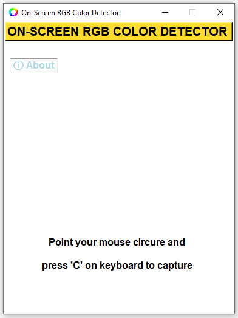
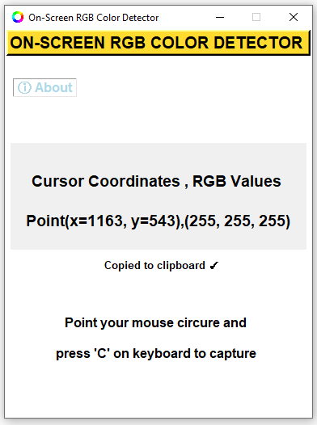

# On Screen RGB Detector
 

<!-- Badge section -->

<!---->

 
 
On-Screen RGB (Red, Green, Blue) Detector is an innovative approach that enables on-screen colour detection with few hand gestures.
Sometimes you need to know the RGB value of a picture or anything else, then you are in the right place.
The On Screen RGB Detector measures the RGB color value of **every single pixel** on your computer screen **live** by following the cursor/mouse pointer position along with the pixel coordinates. 
 
Application is built using Python programing language (3.10) and Tkinter framework for Graphical User Interface (GUI).
 
 

## Working ⚙️

**R, G, B = 255, 255, 255**  ***(Absolute white)*** 

**R, G, B =    0,    0,    0**  ***(Absolute black)*** 

Respectively for all colors :
* R or G or B is (255) 
Represent **Maximum** amount of that color 

* R or G or B is (  0) 
 Represent **Minimum** amount of that color 

## Features
* Measurement of **RGB** colours by following the position of cursor/mouse pointer with pixel coordinate live
* Readings are captured by keystrokes for user convenience
* RGB values are automatically copied to clipboard
 

## 🚀 Getting started

Prerequisites:

* Your computer must be running Python3 or newer.
* The script requires [Tkinter](https://docs.python.org/3/library/tkinter.html) library installed.  
   - Open Terminal and run `pip install tk` to install Tkinter library  
* Get the source [code](https://github.com/Abhijeetbyte/On-Screen-RGB-Detector/archive/refs/heads/main.zip)

* Extract the zip and open <b> main.py</b> in Python IDE to build and run the Calculator app. 
 
 
  Windows users can download the binary release
 
* Your computer must be running Windows 10 or newer.
* Install the latest version of the Application. [Download v1.2](https://github.com/4BH1J337/On-Screen-RGB-Detector/releases/download/v1.2/On-Screen.RGB.Detector_setup.exe)

 

### `Program Execution` 

#
## License

Copyright © Abhijeet kumar. All rights reserved.

Licensed under the [CC0-1.0 License.](LICENSE)
