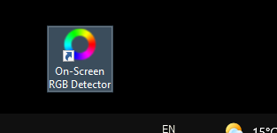

# On Screen RGB Detector
On-Screen RGB (red, blue, green) Detector is an innovative approach that enables on-screen colour detection with few hand gestures. 
However, it is sometimes essential for you to know the picture's RGB values or anything else, then you're in the right place. 
It measures the RGB colour value of every single pixel present on your computer screen by following the position cursor/mouse pointer with pixel coordinate.
The RGB values are measured every 3 seconds meanwhile you can stop the measurement and note down the readings.
Application is built using Python programing language (3.10) and Tkinter framework for Graphical User Interface (GUI).
#
### Size : 13.5 mb 
### compatibility : Windows 10 or above
### [Download v1.1](https://github.com/4BH1J337/On-Screen-RGB-Detector/releases/download/v1.1/On-Screen.RGB.Detector_setup.exe)
#

**_After Installation Icon_**
#

#
**_Program Execution_**
#

#
**_Two buttons were embedded (i) To start the programme or to show RGB values with coordinate (ii) To stop the programme temporarily, since the measurement is taken every 3 seconds, so user can note down the readings of any specific pixel_**
#
#
